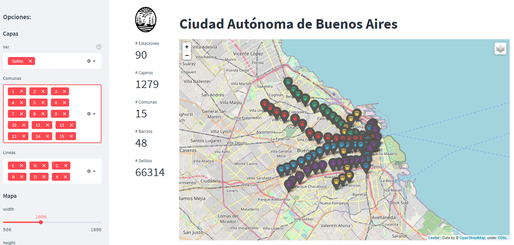
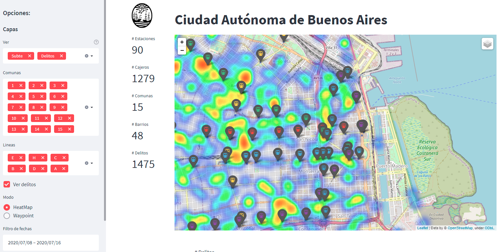
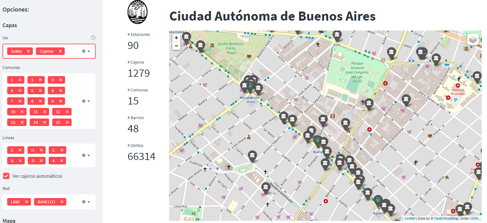

# :earth_americas:  Ciudad Autónoma de Buenos Aires - Waypoints

[]()
[](https://share.streamlit.io/ezeparziale/caba-waypoints-map/app/app_map.py)

Mapa con distintos waypoints de CABA

Se utiliza streamlit para visualización y folium para mapas.







## :floppy_disk: Instalación

```shell
python -m venv env
```

```shell
python -m pip install --upgrade pip
```

```shell
pip install -r requirements.txt
```

:bulb: Esta caso de tener problemas para instalar geopandas en windows hay que instalar GDAL y FIONA manulamente:
Bajar los whl segun corresponda a tu versión de Python de aqui:

```http
https://www.lfd.uci.edu/~gohlke/pythonlibs/#fiona
```

Instalar GDAL:

```shell
pip install GDAL-3.4.1-cp39-cp39-win_amd64.whl
```

Instalar Fiona:

```shell
pip install Fiona-1.8.21-cp39-cp39-win_amd64.whl
```

Luego instalar el requirements.

## :runner: Run

```shell
streamlit run app/app_map.py
```

```http
http://localhost:8501
```

## :pushpin:Funciones

- Localización de estaciones de subte
- Localización de cajeros automaticos
- Localización de delitos 2020
- División por barrios
- División por comunas
- Filtro por comuna
- Heatmap para delitos
- Waypoint por tipos de delitos
- Waypoint estaciones de subte con color de subte
- Comunas filtradas resaltadas en color

## :newspaper: Fuente de datos

Subte:

```http

```

Delitos:

```http

```

Cajeros automaticos:

```http

```

Barrios:

```http
https://data.buenosaires.gob.ar/dataset/barrios/resource/1c3d185b-fdc9-474b-b41b-9bd960a3806e
```

Comunas:

```http
https://data.buenosaires.gob.ar/dataset/comunas/resource/b0b627ac-5b47-4574-89ac-6999b63598ee
```
